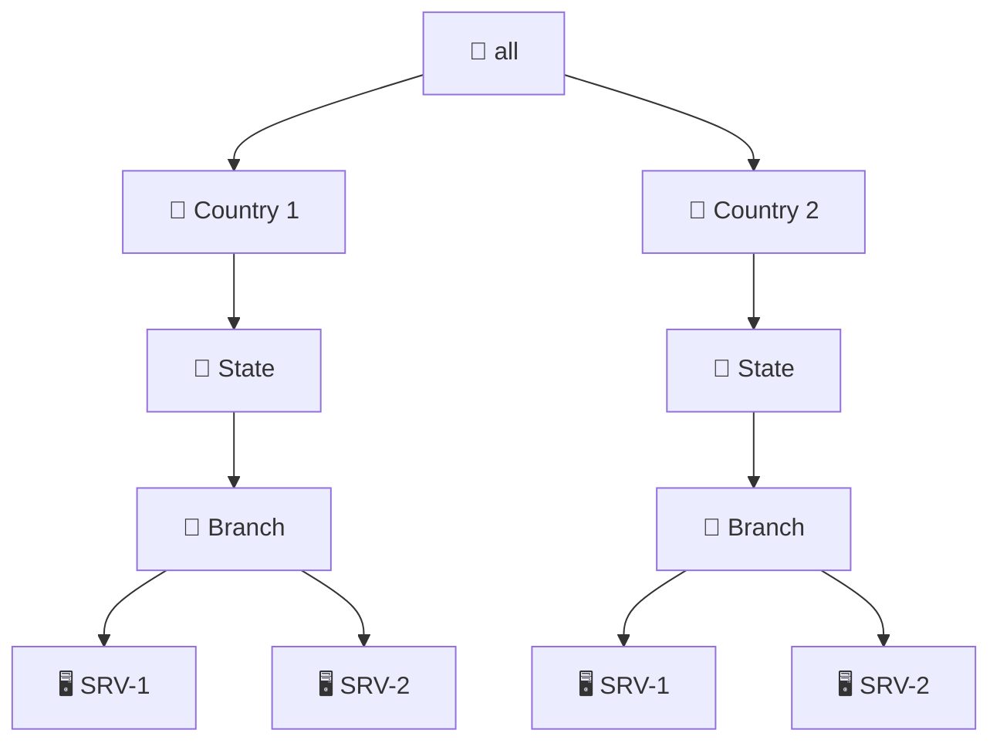

# 📁 mRemoteNG Folder Structure

a powershell to create this Structure in mRemoteNG 

## CSV

| State | Branch   | T    | Connection | Username | Domain | Password | Hostname     |
|-------|----------|------|------------|----------|--------|----------|--------------|
| NY    | DOWNTOWN | USA  | 10.10.10.10 |          |        |          | 10.10.10.10  |

## 🗺️ Folder Hierarchy Flowchart

